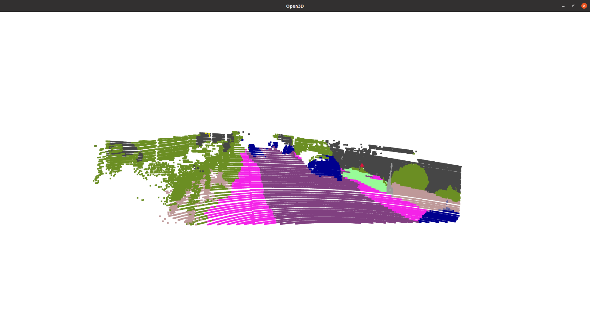

# LiDAR Point Cloud Semantic Segmentation
An implementation of point painting for real-time point cloud semantic segmentation painting (labeling each liDAR point with a class) based on semantic segmentation maps using [DeepLabV3+](https://arxiv.org/abs/1706.05587).

## Dataset
Download the rectified stereo camera images and Velodyne sensor data from the KITTI-360 dataset. Save data in 2 folders respectively. To download them, you can use the the following shell script.
1. Recticied RGB camera images: `bash download_2d_perspective.sh`.
2. Velodyne point cloud `bash download_3d_velodyne.sh`.
3. camera intrinsics and extrinsics from [here](https://s3.eu-central-1.amazonaws.com/avg-projects/KITTI-360/384509ed5413ccc81328cf8c55cc6af078b8c444/calibration.zip]).

## Checkpoint
For the semantic segmentation of RBG images, please download the pre-trained DeepLabV3+ checkpoint from [here](https://drive.google.com/file/d/1X1xudvEsd5zS4wBOo6Y91vwU81pK_hqJ/view?usp=drive_link) which is trained on Cityscapes dataset.

## Run
`python3 /Code/Wrapper.py --DataPath {dir/to/kitti/dataset} --SavePath {dir/to/your/saving/pcd/folder} --CkptPath {dir/to/DeepLabV3+/checkpoint} --ParseData {Parse the raw point cloud data, Default:0}`

## Demo

## References
- DeepLabv3 https://towardsdatascience.com/review-deeplabv3-atrous-convolution-semantic-segmentation-6d818bfd1d74
- Point Painting https://github.com/AmrElsersy/PointPainting/tree/master
